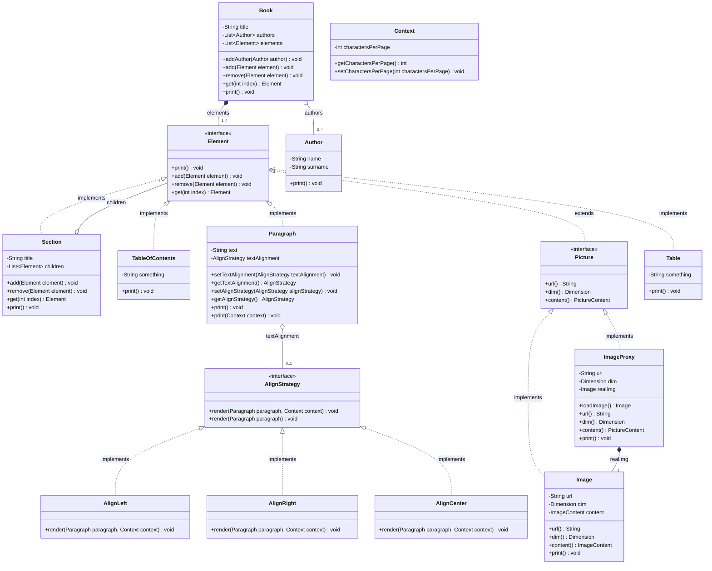

# Bookish - Design Patterns & Clean Architecture

## 1. Project Overview
**Bookish** is a modular document and book management platform inspired by cloud storage services (like Google Drive). The goal of the project is to build an extensible, maintainable system applying **Design Patterns**, **SOLID principles**, and **Clean Code** practices.

The initial milestones focus on the core domain model for representing documents hierarchically, formatting text dynamically, and lazily loading heavy media resources.

---

## 2. Architectural Design

### 2.1 The Composite Pattern
The document structure follows the Gang of Four (GoF) **Composite Pattern** (transparent variant). This allows clients to treat individual content elements and compositions of elements uniformly.

### 2.2 The Strategy Pattern
Text alignment follows the GoF **Strategy Pattern**. A `Paragraph` delegates its rendering to an `AlignStrategy` (`AlignLeft`, `AlignRight`, or `AlignCenter`), with an optional `Context` (representing parameters such as characters per page).

### 2.3 The Proxy Pattern
Image loading follows the GoF **Proxy Pattern** (Virtual Proxy variant). An `ImageProxy` stands in for an `Image` object implementing the common `Picture` interface. Heavy real image instances are only instantiated lazily on demand when `loadImage()`, `print()`, or `content()` is accessed.



---

## 3. Package & Class Structure

All domain entities reside in package: `org.sp.bookish.entity`

| Class / Interface | Role in Pattern | Description |
| :--- | :--- | :--- |
| [`Element`](file:///D:/Lucian/Java/Bookish/src/main/java/org/sp/bookish/entity/Element.java) | **Component** | Declares the common interface for all components in the document tree (`print()`, `add()`, `remove()`, `get()`). Default methods throw `UnsupportedOperationException` for leaf elements. |
| [`Section`](file:///D:/Lucian/Java/Bookish/src/main/java/org/sp/bookish/entity/Section.java) | **Composite** | Represents a structured section / chapter with a title and a list of child `Element` objects. Propagates operations like `print()` recursively to its children. |
| [`Paragraph`](file:///D:/Lucian/Java/Bookish/src/main/java/org/sp/bookish/entity/Paragraph.java) | **Leaf & Context** | Holds text content and an optional `AlignStrategy` reference (`textAlignment`). Delegates rendering to strategy if present. |
| [`Picture`](file:///D:/Lucian/Java/Bookish/src/main/java/org/sp/bookish/entity/Picture.java) | **Subject Interface** | Common interface extending `Element` for both real images and image proxies (`url()`, `dim()`, `content()`). |
| [`Image`](file:///D:/Lucian/Java/Bookish/src/main/java/org/sp/bookish/entity/Image.java) | **Real Subject** | Represents real image resource with url, dimensions, and image content. |
| [`ImageProxy`](file:///D:/Lucian/Java/Bookish/src/main/java/org/sp/bookish/entity/ImageProxy.java) | **Proxy** | Virtual proxy that defers loading of `Image` until needed via `loadImage()`. |
| [`Dimension`](file:///D:/Lucian/Java/Bookish/src/main/java/org/sp/bookish/entity/Dimension.java) | **Value Object** | Holds 2D image dimensions (`width`, `height`). |
| [`PictureContent`](file:///D:/Lucian/Java/Bookish/src/main/java/org/sp/bookish/entity/PictureContent.java) | **Content Model** | Base class representing picture content. |
| [`ImageContent`](file:///D:/Lucian/Java/Bookish/src/main/java/org/sp/bookish/entity/ImageContent.java) | **Content Model** | Specific content payload for images. |
| [`Table`](file:///D:/Lucian/Java/Bookish/src/main/java/org/sp/bookish/entity/Table.java) | **Leaf** | Represents tabular data or placeholder content. |
| [`TableOfContents`](file:///D:/Lucian/Java/Bookish/src/main/java/org/sp/bookish/entity/TableOfContents.java) | **Leaf** | Represents the book / document table of contents. |
| [`Book`](file:///D:/Lucian/Java/Bookish/src/main/java/org/sp/bookish/entity/Book.java) | **Root Entity** | Contains the book's title, authors, and root-level `Element` contents. |
| [`Author`](file:///D:/Lucian/Java/Bookish/src/main/java/org/sp/bookish/entity/Author.java) | **Entity** | Holds author identity (`name`, `surname`) and a `print()` method. |
| [`AlignStrategy`](file:///D:/Lucian/Java/Bookish/src/main/java/org/sp/bookish/entity/AlignStrategy.java) | **Strategy Interface** | Defines the contract for alignment rendering: `render(Paragraph, Context)`. |
| [`AlignLeft`](file:///D:/Lucian/Java/Bookish/src/main/java/org/sp/bookish/entity/AlignLeft.java) | **Concrete Strategy** | Left alignment rendering strategy. |
| [`AlignRight`](file:///D:/Lucian/Java/Bookish/src/main/java/org/sp/bookish/entity/AlignRight.java) | **Concrete Strategy** | Right alignment rendering strategy. |
| [`AlignCenter`](file:///D:/Lucian/Java/Bookish/src/main/java/org/sp/bookish/entity/AlignCenter.java) | **Concrete Strategy** | Center alignment rendering strategy. |
| [`Context`](file:///D:/Lucian/Java/Bookish/src/main/java/org/sp/bookish/entity/Context.java) | **Strategy Context** | Context object holding configuration such as `charactersPerPage`. |

---

## 4. Design Decisions

1. **Simplicity First (No SQL / JPA for now)**:
   - Domain models are pure Java POJOs, keeping them easily testable and decoupled from persistence mechanisms.
2. **Transparent Composite**:
   - `Element` interface provides default implementations for `add`, `remove`, and `get` that throw `UnsupportedOperationException`. Leaf classes don't need redundant stub implementations, while `Section` overrides them.
3. **Strategy Pattern for Alignment**:
   - Encapsulates text alignment algorithms away from `Paragraph`.
   - Strategies can be interchanged dynamically at runtime using `setTextAlignment` / `setAlignStrategy`.
4. **Proxy Pattern for Media**:
   - `ImageProxy` acts as a surrogate for `Image`. It stores lightweight metadata (`url`, `dim`) without immediately instantiating the real image until `loadImage()`, `content()`, or `print()` is requested.
5. **Encapsulation & Extensibility**:
   - Standard getters, setters, and constructors are supplied for easy instantiation and serialization.

---

## 5. Usage Example

```java
Author author = new Author("Robert", "Martin");
Book noSqlBook = new Book("Clean Code");
noSqlBook.addAuthor(author);

Section cap1 = new Section("Chapter 1: Clean Code");

Paragraph p1 = new Paragraph("Writing clean code is what you must do...");
p1.setTextAlignment(new AlignLeft());

Paragraph p2 = new Paragraph("Names should reveal intent.");
p2.setTextAlignment(new AlignCenter());

Paragraph p3 = new Paragraph("Functions should do one thing.");
p3.setTextAlignment(new AlignRight());

// Lazy loading image via proxy
ImageProxy imgProxy = new ImageProxy("clean_code_cover.png", new Dimension(800, 600));

cap1.add(p1);
cap1.add(p2);
cap1.add(p3);
cap1.add(imgProxy);

noSqlBook.add(cap1);
noSqlBook.print();
```

---

## 6. Future Roadmap

- **Visitor Pattern**: For document serialization, statistics (word count, image count), and rendering.
- **Persistence (JPA/Hibernate)**: When persistence is ready, mapping the composite hierarchy using JPA entities with inheritance strategies.
- **REST Controller & Drive Services**: Uploading, organizing, and versioning documents in a Google Drive-like API.
